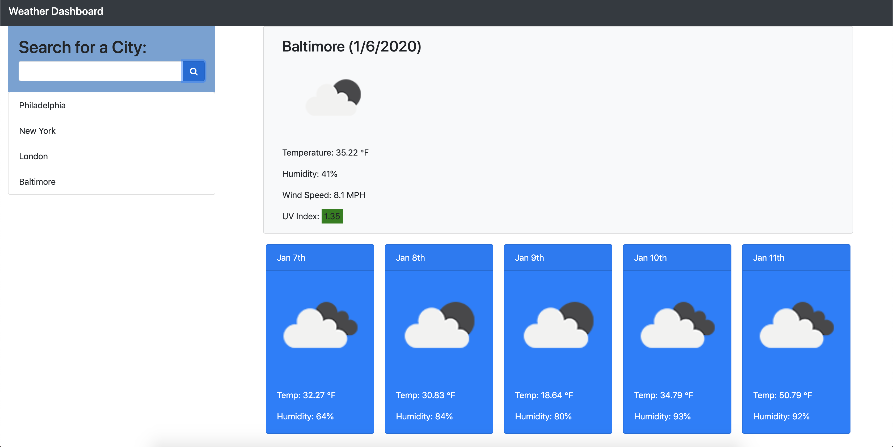

# 06-Weather-Dashboard

* [Screenshot] 
* [`Git Hub Repo](https://github.com/hannalip/06-Weather-Dashboard)
* [Git Hub IO Link](https://hannalip.github.io/06-Weather-Dashboard/)
* [`HTML`](index.html)
* [`JavaScript`](script.js)
* [`CSS`](style.css)

In this assignment, I am going to create Weatber Dashboard. The weather dashboard allows you to search a city and puts the current weather, UV Index, and the next 5 Day Forecast. The searched city is saved to local storage and is able to be clicked to reseach.

## Instructions

* In a file called `script.js`

  1. I created a function to call an API. I used the jQuery AJAX method to make requests to server-side APIs.

  2. Depending on the UV Index the color of the number will turn green or red.

  3. When the user searches a city the city saves to local storage and is able to be clicked to research the city's forcast even when the page is refreshed or exited.

### Elements within Javascript file

  * variables

  * Local Storage

  * JSON 

  * IF/ELSE statements

  * Moments

  * Event Listener

  * Functions
  
  * AJAX

  * Server-side APIs

  * Bootstrap

* **NOTE:** Use CSS to clean up the web page.

